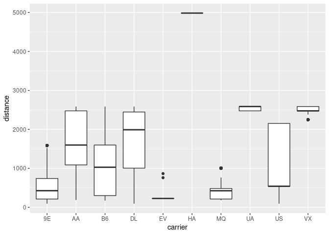

Steps to get started with dplyr & Postgres, using dbplyr.

## Postgres Setup

[Don’t install Postgres. Docker pull
Postgres](https://hackernoon.com/dont-install-postgres-docker-pull-postgres-bee20e200198)

To avoid installing Postgres locally use Docker.

Pull image for the latest stable release:

``` bash
docker pull postgres
```

Start Postgres:

``` bash
docker run \
  -d --rm \
  --name pg-docker \
  -e POSTGRES_PASSWORD=docker \
  -p 127.0.0.1:5432:5432 \
  postgres
```

## db Connection

### Setup

The [DBI package](https://github.com/r-dbi/DBI) provides a simple
interface for connecting to databases and, along with the [odbc
package](https://github.com/r-dbi/odbc), makes it easy to set up
connections to any with [Open Database Connectivity
(ODBC)](https://docs.microsoft.com/en-us/sql/odbc/microsoft-open-database-connectivity-odbc?redirectedfrom=MSDN&view=sql-server-ver15)
drivers.

Install odbc dependencies and Postgres driver:

``` bash
sudo apt-get install unixodbc unixodbc-dev
sudo apt-get install odbc-postgresql
```

Install DBI and odbc:

``` r
install.packages(c('DBI','odbc'))
```

Check odbc package can find Postgres driver:

``` r
# list unique driver names
unique(odbc::odbcListDrivers()['name'])
```

    ##                 name
    ## 1    PostgreSQL ANSI
    ## 7 PostgreSQL Unicode

### Connection

Connect to Postgres database:

``` r
# load DBI package
library(DBI)

# create connection
con <- dbConnect(
  odbc::odbc(),
  Driver = 'PostgreSQL Unicode',
  Server = '127.0.0.1',
  Database = 'postgres',
  UID = 'postgres',
  PWD = 'docker',
  Port = 5432
)
```

## dbplyr

[Introduction to
dbplyr](https://dbplyr.tidyverse.org/articles/dbplyr.html)

Install tidyverse packages (and nycflights13 data):

``` r
install.packages(c('tidyverse', 'nycflights13'))
```

Use dbplyr to load nycflights13 data to database:

``` r
# load tidyverse packages
library(tidyverse)

# copy data to database
con %>%
  copy_to(nycflights13::flights, 'flights')
```

dbplyr interacts with database tables through table references:

``` r
# create table reference to 'flights' table
flights <- tbl(con, 'flights')

# return top of flights table
head(flights)
```

    ## # Source:   lazy query [?? x 19]
    ## # Database: postgres [postgres@localhost:/postgres]
    ##    year month   day dep_time sched_dep_time dep_delay arr_time sched_arr_time
    ##   <int> <int> <int>    <int>          <int>     <dbl>    <int>          <int>
    ## 1  2013     1     1      517            515         2      830            819
    ## 2  2013     1     1      533            529         4      850            830
    ## 3  2013     1     1      542            540         2      923            850
    ## 4  2013     1     1      544            545        -1     1004           1022
    ## 5  2013     1     1      554            600        -6      812            837
    ## 6  2013     1     1      554            558        -4      740            728
    ## # … with 11 more variables: arr_delay <dbl>, carrier <chr>, flight <int>,
    ## #   tailnum <chr>, origin <chr>, dest <chr>, air_time <dbl>, distance <dbl>,
    ## #   hour <dbl>, minute <dbl>, time_hour <dttm>

Once a table reference has been created you can use dplyr to interrogate
the table.

dplyr tries to interact with the database as little as possible:

``` r
# this will not touch the database
flights_jfk <-
  flights %>%
  filter(origin == 'JFK')

# this will
flights_jfk %>%
  ggplot() +
  geom_boxplot(aes(carrier, distance))
```

<!-- -->
